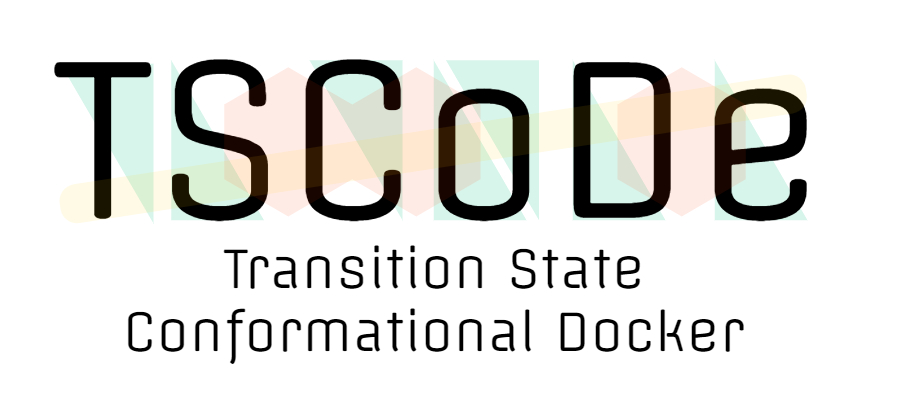

# TSCoDe - Transition State Conformational Docker

  

TSCoDe is a systematical conformational embedder for small molecules. It helps computational chemists build transition states and binding poses precisely in an automated way. It is thought as a tool to explore complex multimolecular conformational space fast and systematically, and yield a series of starting points for higher-level calculations.

Since its inclusion of many subroutines and functionality, it also serves as a computational toolbox
to automate various routine tasks, via either MM, semiempirical or DFT methods.

## :toolbox: Dependencies
TSCoDe is written in pure Python. It leverages various libraries like Numpy and Numba to perform the linear algebra required to translate and rotate molecules, NetworkX to perform graph operations, and the [ASE](https://github.com/rosswhitfield/ase) environment to perform a set of structure manipulations. Additionally, [Openbabel](http://openbabel.org/wiki/) is required to perform I/O operation and optional force field optimizations. It supports various external calculators to outsource force field/semiempirical/DFT optimization:

-  XTB (>=6.3)
-  ORCA (>=4.2)
-  Gaussian (>=9)
-  MOPAC2016

## Documentation
Documentation on how to install and use the program can be found on [readthedocs](https://tscode.readthedocs.io/en/latest/index.html).