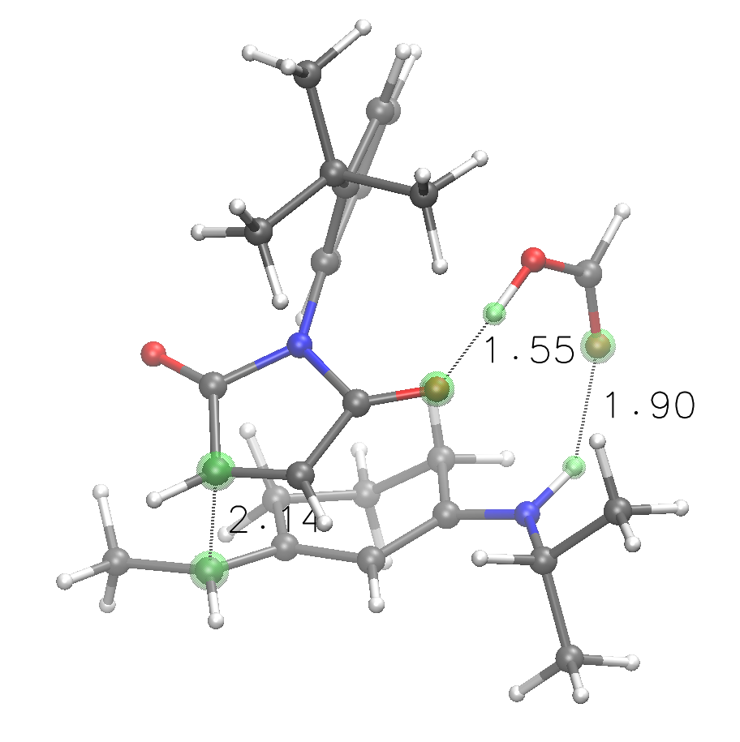

# TSCoDe - Transition State Conformational Docker

 

TSCoDe is the first systematical conformational embedder for bimolecular and trimolecular chemical reactions. It is able to generate a comprehensive set of both regioisomeric and stereoisomeric poses for molecular arrangements, provided the atoms that will be reacting. It supports both open and cyclical transition states. By feeding the program conformational ensembles, it also generates all conformations combinations. It is thought as a tool to explore TS conformational space in a fast and systematical way, and yield a series of starting points for higher-level calculations.

**NOTE: structures obtained from TSCoDe are not proper transition states (most of the times) but are often quite close. The program is intended to yield and rank poses, not TSs. In this way, the computational chemist can skip the error-prone phase of molecular embedding and proceed to the most appropriate higher-level calculation step.**

### Required packages and tools
TSCoDe is written mostly in Python, with some libraries optionally boosted via Cython. It leverages the numpy library to do the linear algebra required to translate and rotate molecules, and the [ASE](https://github.com/rosswhitfield/ase) environment to perform a set of manipulation on the provided structures through the [MOPAC2016](http://openmopac.net/MOPAC2016.html) calculator. While the former is free software, the latter is only free for academic use, and a license must be requested via the MOPAC website.

## :green_circle: What the program can do (well)
**Generate accurately spaced poses** for bimolecular and trimolecular transition states of organic molecules by various manipulations, including structural deformation. If a transition state is already in hand, the distance between reactive atoms can be specified, so as to obtain all the stereo/regioisomeric analogs with precise molecular spacings.

## :yellow_circle: What the program can do (sometimes)
**Infer differential NCIs** - After the poses generation, the program will try to infer the non-covalent interactions (NCIs) between all generated structures, and if a particular NCI is not shared by all of them, that is reported in the program output. I a particularly strong NCI is present only in a given TS, this can be a handy indicator of the source of selectivity in a given chemical reaction.

**Generate transition state structures** (semiempirical level) - After poses generation, these can be used to try to directly obtain transition state structures at the semiempirical level chosen. This is not a default behavior, and it is invoked by the `NEB` keyword. A climbing image nudged elastic band (CI-NEB) transition state search is performed after inferring both reagents and products for each individual pose. This entire process is of course challenging to automate completely, and can be prone to failures. Associative reactions, where two (or three) molecules are bound together (or strongly interacting) after the TS, with no additional species involved, tend to give good results. For example, cycloaddition reactions are great candidates while atom transfer reactions (*i.e.* epoxidations) are not.

## :red_circle: What the program cannot do
**Perfectly replicate TS structures at high levels of theory** - As the program exploits MOPAC to perform calculations, final geometries arise from constrained optimizations at a semiempirical level of theory (default is PM7). They are therefore not granted to perfectly replicate higher-level calculations. However, constrained optimizations through external programs are meant to be used to refine these structures and obtain TSs.

## Installation
### Windows 
I you have Git installed, clone the repository: *(otherwise download the code and unpack it)*

    git clone https://github.com/ntampellini/TSCoDe
    
Open a command shell, move to the TSCoDe folder and install the requirements.

    pip install -r requirements.txt

After these have been installed, if you haven't already, you should [request a licence for MOPAC2016](http://openmopac.net/form.php). After installation, be sure to add the MOPAC folder to your system PATH, to access the program through command line with the "mopac2016" command. To test this, the command `mopac2016` should return [this](https://gist.github.com/ntampellini/82224abb9db1c1880e91ad7e0682e34d) message.

## Usage

    python tscode.py $PathToInputFolder/myinput.txt

### Example of `myinput.txt`
    DIST(a=1.84, b=2.2012) SUPRAFAC NEB
    nitrostyrene.xyz 0a 1b
    diaminopentadiene.xyz 5a 8b
    # Diels-Alder reaction
    

### Input formatting
The program input can be any text file.
- Any blank line will be ignored
- Any line starting with `#` will be ignored as a comment
- Keywords, if present, need to be on first non-blank, non-comment line
- Then, two or three molecule files are specified, along with their reactive atoms indexes

TSCoDe can work with all molecular formats read by [cclib](https://github.com/cclib/cclib), but best practice is using only the `.xyz` file format, particularly for multimolecular files containing different conformers of the same molecule. **The reactive indexes specified are counted starting from zero!** If the molecules are specified without reactive indexes, a pop-up ASE GUI window will guide the user into manually specifying the reactive atoms after running the program.
 
Reactive atoms supported are `CHONPS`. Reactions can be of four kinds:
- Two molecules, one reactive atom each - "string embed" (*i.e.* SN2 reactions)
- Two molecules, one with one reactive atom and the other with two reactive atoms - "chelotropic embed" (*i.e.* epoxidations)
- Two molecules, two reactive atoms each - "cyclical embed" (i.e. Diels-Alder reactions)
- Three molecules, two reactive atoms each - "cycical embed" (i.e. reactions where two partners are bridged by a carboxylic acid)

After each reactive index, it is possible to specify a letter (`a`, `b` or `c`) to represent the "flag" of that atom. If provided, the program will only yield the regioisomers that respect those atom pairings. For "chelotropic embeds", one could specify that a single atom has two flags, for example the oxygen of a peracid, like `4ab`.
  
### Keywords

Keywords are divided by at least one blak

- **SUPRAFAC** - Only retain suprafacial orbital configurations in cyclical TSs. Thought for Diels-Alder and other cycloaddition reactions.

- **DEEP** - Performs a deeper search, retaining more starting points for calculations and smaller turning angles. Equivalent to `THRESH=0.3 STEPS=12 CLASHES=(num=5, dist=1)`

- **NOOPT** - Skip the optimization steps, directly writing structures to file.

  

- **STEPS** - Manually specify the number of steps to be taken in scanning rotations. The standard value of 6 will perform six 60° turns. Syntax: `SCAN=n`, where n is an integer. **UPDATE**

  

- **BYPASS** - Debug keyword. Used to skip all pruning steps and directly output all the embedded geometries.

  

- **THRESH** - RMSD threshold (Angstroms) for structure pruning. The smaller, the more retained structures. Default is 0.5 A. Syntax: `THRESH=n`, where n is a number.

  

- **DIST** - Manually imposed distance between specified atom pairs, in Angstroms. Syntax uses parenthesis and commas: `DIST(a=2.345, b=3.67, c=2.1)`

  

- **CLASHES** - Manually specify the max number of clashes and the distance threshold at which two atoms are considered clashing. The more forgiving, the more structures will reach the geometry optimization step. Syntax: `CLASHES(num=3, dist=1.2)`

  

- **NEWBONDS** - Manually specify the maximum number of "new bonds" that a TS structure can have to be retained and not to be considered scrambled. Default is 1. Syntax: `NEWBONDS=1`

  

- **NEB** - Perform an automatical NEB TS search after the partial optimization step, inferring reagents and products. This option is only really usable for those reactions in which two (or three) molecules are bound together (or strongly interacting) after the TS, with no additional species involved. For example, cycloaddition reactions are great candidates while atom transfer reactions (*i.e.* epoxidations) are not.

  

- **LEVEL** - Manually set the MOPAC theory level to be used, default is PM7. Syntax: `LEVEL=PM7`

  

- **RIGID** - Avoid bending structures to better build TSs.

  

- **NONCI** - Avoid estimating and printing non-covalent interactions.

  

- **ONLYREFINED** - Discard structures that do not successfully refine bonding distances.

  

- **LET** - Overrides safety checks that prevent the program from running too large calculations.
<!--stackedit_data:
eyJoaXN0b3J5IjpbLTE5NjMwMzY5MTEsNjAwMjg3MzA3LDU0Nz
ExMjc5OSwtNjcyMTE4NTYwXX0=
-->