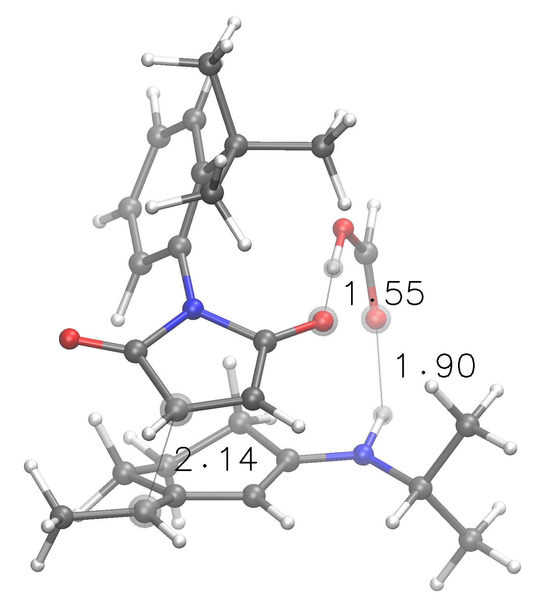
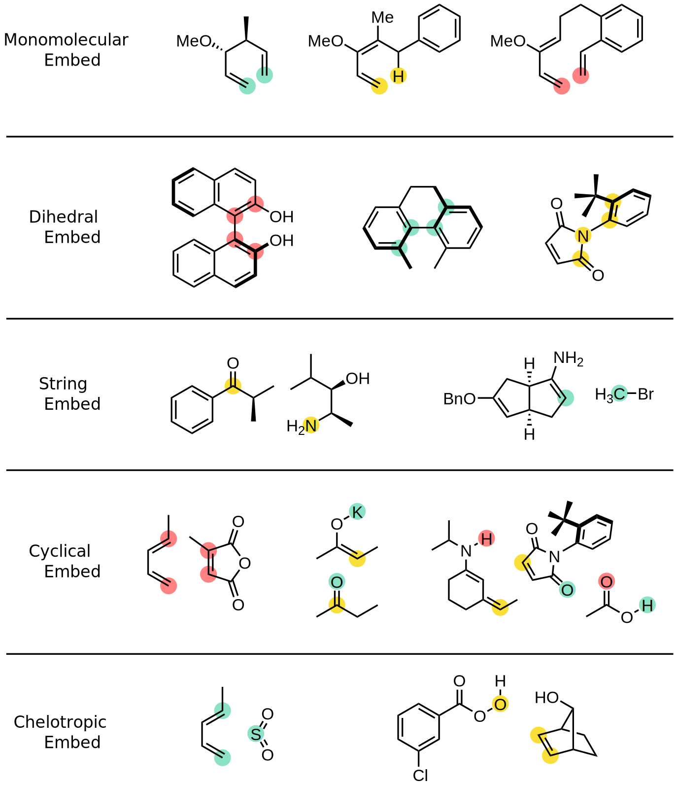

# TSCoDe - Transition State Conformational Docker

 
 
 
 
 

  

TSCoDe is the first systematical conformational embedder for bimolecular and trimolecular chemical reactions. It is able to generate a comprehensive set of both regioisomeric and stereoisomeric poses for molecular arrangements, provided the atoms that will be reacting. It supports both open and cyclical transition states. By feeding the program conformational ensembles, it also generates all conformations combinations. It is thought as a tool to explore TS conformational space in a fast and systematical way, and yield a series of starting points for higher-level calculations.

**NOTE: structures obtained from TSCoDe are not proper transition states (most of the times) but are often quite close. The program is intended to yield and rank poses, not TSs. In this way, the computational chemist can skip the error-prone phase of molecular embedding and proceed to the most appropriate higher-level calculation step.**

### Required packages and tools
TSCoDe is written in pure Python. It leverages the numpy library to do the linear algebra required to translate and rotate molecules, the OpenBabel software for performing force field optimization and the [ASE](https://github.com/rosswhitfield/ase) environment to perform a set of structure manipulations through one of the [supported calculators](#installation).

## :green_circle: What the program can do (well)
**Generate accurately spaced poses** for bimolecular and trimolecular transition states of organic molecules, also considering structural deformation. If a transition state is already in hand, the distance between reactive atoms can be specified, so as to obtain all the stereo/regioisomeric analogs with precise molecular spacings.

Monomolecular transition states are also supported, with atropisomers rotations and sigmatropic reactions in mind.

TSCoDe is best suited for modelizations that involve many transition state regio- and stereoisomers, where the combination of reagents conformations is an important aspect in transition state building. The program can yield many chemically convincing atomic arrangements that can be evaluated by the computational chemist, aiding them in exploring all conformational and regio/stereochemical space.

## :yellow_circle: What the program can do (sometimes)
**Infer differential NCIs** - After the poses generation, the program can be told to infer the non-covalent interactions (NCIs) between  molecules in the generated structures (`NCI` keyword). If a particular NCI is not shared by all structures, that is reported. If a particularly strong NCI is present only in a few TSs, this function can be a handy tool for tracing the source of selectivity in a given chemical reaction.

**Generate proper transition state structures** (semiempirical level) - After poses generation, these structures can be used to try to directly obtain transition state structures at the semiempirical level chosen. This is not a default behavior, and it is invoked by the `NEB` keyword. A climbing image nudged elastic band (CI-NEB) transition state search is performed after inferring both reagents and products for each individual pose. This entire process is of course challenging to automate completely, and can be prone to failures. Associative reactions, where two (or three) molecules are bound together (or strongly interacting) after the TS, with no additional species involved, tend to give good results. For example, cycloaddition reactions are great candidates while atom transfer reactions (*i.e.* epoxidations) are not. This is intended more as an experimenting tool than a reliable, definitive feature.

## :red_circle: What the program cannot do
**Completely replace calculations at higher levels of theory** - Output geometries arise from constrained optimizations, by default at semiempirical levels of theory (PM3, PM6, PM7). They are therefore not proper transition states, and are to be used as starting points for higher-level calculations. External programs are meant to be used to refine these structures and obtain real TSs. Nevetheless, the program can significatively speed up and reinforce the systematicity of the transition state embedding process.

## Installation

This program is written in pure Python and it is intended to use with Python version 3.8.10. The use of a dedicated conda virtual environment is highly enocouraged.

Prerequisites: before downloading this repository, you should have installed at least one calculator. At the moment, TSCoDe supports three calculators:
- MOPAC2016
- ORCA
- Gaussian

An installation of Openbabel is optional, providing an additional conformational search tool and Force Field minimizations that can speed up the program.

### MOPAC2016

This software is closed-source but free for academic use. If you qualify for this usage, you should [request a licence for MOPAC2016](http://openmopac.net/form.php). After installation, be sure to add the MOPAC folder to your system PATH, to access the program through command line with the "MOPAC2016.exe" command. To test this, the command `MOPAC2016.exe` should return [this](https://gist.github.com/ntampellini/82224abb9db1c1880e91ad7e0682e34d) message.

### ORCA

This software is only free for academic use at an academic institution. Detailed instructions on how to install and set up ORCA can be found in [the official website](https://sites.google.com/site/orcainputlibrary/setting-up-orca). Make sure to install and set up OpenMPI along with ORCA if you wish to exploit multiple cores on your machine **(Note: semiempirical methods cannot be parallelized in ORCA!)**

### Gaussian

This is commercial software available at [the official website](https://gaussian.com/).

### Openbabel

This is free software you can download from [the official website](http://openbabel.org/wiki/Category:Installation). After you have installed the software, make sure to install its Python bindings. You can manually compile these by following the [website guidelines](https://openbabel.org/docs/dev/Installation/install.html#compile-bindings), but *by far* the easiest procedure is just using conda inside a conda virtual environment:

    conda install -c conda-forge openbabel

### TSCoDe

If you have Git installed, you can directly clone the repository: *(otherwise download the code and unpack it)*

    git clone https://github.com/ntampellini/TSCoDe
    
Open a command shell, move to the ./TSCoDe folder and install the requirements.

    cd TSCoDe

    pip install -r requirements.txt

Assert all commands and settings are consistent with your system and desired usage of TSCoDe by modifying the [settings.py](https://github.com/ntampellini/TSCoDe/blob/master/settings.py) file.
- By default, the used calculator is MOPAC, so if you wish to use ORCA or GAUSSIAN set the calculator accordingly. (*i.e.* `CALCULATOR = 'ORCA'`)
- By default, OpenBabel support is turned off. If you have it installed, set `OPENBABEL_OPT_BOOL = False` to activate it.

To test the installation, you can run the provided test in the test folder:

    python tests/run_tests.py

This should take less than 10 minutes on a modern laptop and point out if any part of the installation is faulted.

## Usage

The program can be run from terminal, both from the TSCoDe folder

    python tscode.py <path_to_input_folder>/myinput.txt [custom_title]

or from the input folder.

    python <path_to_TSCoDe_folder>/tscode.py myinput.txt [custom_title]

A custom title for the run can be optionally provided, otherwise a time stamp will be used to name the output files.

### Examples of `myinput.txt`

    DIST(a=2.135,b=1.548,c=1.901) NEB
    maleimide.xyz 0a 5b
    opt>HCOOH.xyz 4b 1c
    csearch>dienamine.xyz 6a 23c

    # Free number of comment lines!

    # First pairing (a) is the C-C reactive distance
    # Second and third pairings (b, c) are the
    # hydrogen bonds bridging the two partners.

    # Structure of HCOOH.xyz will be optimized before running TSCoDe
    # A conformational analysis will be performed on dienamine.xyz before running TSCoDe
    

<i>
Best transition state arrangement found by TSCoDe for the above trimolecular input, following imposed atom spacings and pairings
</i>

    KCAL=10 CALC=MOPAC LEVEL=PM7
    atropisomer.xyz 1 2 9 10

<i>
Best transition state arrangement found by TSCoDe for the above input (left) and plot of energy as a function of the dihedral angle (right). All useful structures and plots are made available to the user by TSCoDe.
</i>

### Input formatting
The input can be any text file. The extension is arbitrary but I suggest sticking with `.txt`.
- Any blank line will be ignored
- Any line starting with `#` will be ignored
- Keywords, if present, need to be on first non-blank, non-comment line
- Then, two or three molecule files are specified, along with their reactive atoms indexes, and eventually their pairings

TSCoDe can work with all molecular formats read by [cclib](https://github.com/cclib/cclib), but best practice is using only the `.xyz` file format, particularly for multimolecular files containing different conformers of the same molecule. **Reactive indexes are counted starting from zero!** If the molecules are specified without reactive indexes, a pop-up ASE GUI window will guide the user into manually specifying the reactive atoms after running the program *(not available from CLI)*.
 
Reactive atoms supported include various hybridations of `C, H, O, N, P, S, F, Cl, Br and I`. Many common metals are also included (`Li, Na, Mg, K, Ca, Ti, Rb, Sr, Cs, Ba, Zn`), and it is easy to add more if you need them. Reactions can be of six kinds:
- **monomolecular** embed - One molecule, two reactive atoms (*i.e.* Cope rearrangements)
- **dihedral** embed - One molecule, four reactive atoms (*i.e.* racemization of BINOL)
- **string** embed - Two molecules, one reactive atom each (*i.e.* SN2 reactions)
- **chelotropic** embed - Two molecules, one with a single reactive atom and the other with two reactive atoms (*i.e.* epoxidations)
- **cyclical** embed (bimolecular) - Two molecules, two reactive atoms each (*i.e.* Diels-Alder reactions)
- **cyclical** embed (trimolecular) - Three molecules, two reactive atoms each (*i.e.* reactions where two partners are bridged by a carboxylic acid like the example above)

<i>
Colored dots represent imposed atom pairings. Note that monomolecular embeds only support two reactive atoms at the moment (feature requests are encouraged).
</i>

After each reactive index, it is possible to specify a letter (`a`, `b` or `c`) to represent the "flag" of that atom. If provided, the program will only yield the regioisomers that respect these atom pairings. For "chelotropic embeds", one could specify that a single atom has two flags, for example the hydroxyl oxygen atom of a peracid, like `4ab`.

If a `NEB` calculation is to be performed on a trimolecular transition state, the reactive distance "scanned" is the first imposed (`a`). See `NEB` keyword in the keyword section.

#### Operators

Molecule files can be preceded by *operators*, like `csearch>molecule.xyz`. They operate on the input file before it is fed to TSCoDe. It is important not to include any space character between the operator and the molecule name.

- **`opt>`** - Performs an optimization of the structure(s) before using it/them in TSCoDe. Generates a new `molecule_opt.xyz` file with the optimized coordinates.

- **`csearch>`** - Performs a simple Openbabel conformational search and optimizes all obtained conformers. Then, a maximum of five best conformers are used to run TSCoDe (overriden with `LET` keyword). Generates a new `molecule_confs.xyz` file with all optimized conformers.
  
### Good practice and suggested options

When modeling a reaction through TSCoDe, I suggest following these guidelines. Not all of them apply to all embed types, but they will surely help in leveraging the program in the best way.

0) Assess that the reaction is supported by TSCoDe. See Input formatting.

1) Obtain molecular structures in .xyz format. If more conformers are to be used, they must be in a multimolecular .xyz file, and atom ordering must be consistent throughout all structures. I suggest using a maximum of 5 conformers for each structure (ideally less) as these calculations have a steep combinatorial scaling (particularly for trimolecular cyclical embeds).

2) If a given molecules is present in the transition state, but it is not strictly involved in bonds breaking/forming, then that molecule needs to be joined with the one with which it is interacting. That is, this new molecule should be the bimolecular interaction complex. This is often the case for catalysts. For example, if the reaction between a ketone and a metal enolate is catalyzed by a thiourea that activates the ketone carbonyl, then the TSCoDe modelization of the reaction should be bimolecular. The first molecule is the ketone-thiourea interaction complex while the second one is the metal enolate.

3) Understand what atoms are reacting for each structure and record their index (**starting from 0!**). If you are unsure of reactive atomic indexes, you can run a test input without indexes, and the program will ask you to manually specify them from the ASE GUI by clicking. This is not possible if you are running TSCoDe from a command line interface (CLI). When choosing this option of manually picking atoms, it is not possible to specify atom pairings. Therefore, I suggest using this option only to check the reactive atoms indexes and then building a standard input file.

4) Optionally, after specifying reactive indexes, the `CHECK` keyword can be used. A series of pop-up ASE GUI windows will be displayed, showing each molecule with a series of red dots around the reactive atoms chosen. This can be used to check "orbital" positions or conformer reading faults (scroll through conformers with page-up and down buttons). Program will terminate after the last visualization is closed.

5) By default, TSCoDe parameters are optimized to yield good results without specifying any keyword nor atom pairing. However, if you already have information on your system, I strongly encourage you to specify all the desired pairings. Trimolecular TSs without imposed pairings are 8 times more than the ones with defined pairings. Also, if you have an accurate idea of the distances between reactive atoms in your desired TSs, the `DIST` keyword can yield structures that are *very* close to higher theory level TSs. These can come from a previous higher-level calculation or can be inferred by similar reactions. If no pairing distances are provided, a guess is performed by reading editable parameters on the `parameters.py` file.

6) If the reaction involves big molecules, or if a lot of conformations are to be used, a preliminar run using the `NOOPT` keyword may be a good idea to see how many structures are generated and would require MOPAC/ORCA optimization in a standard run.

7) If TSCoDe does not find any suitable candidate for the given reacion, most of the times this is because of compenetration pruning. This mean that a lot of structures are generated, but all of them have some atoms compenetrating one into the other, and are therefore discarded. A solution could be to loosen the compenetration rejection citeria (`CLASHES` keyword, not recommended) or to use the `SHRINK` keyword (recommended, see keywords section). Note that `SHRINK` calculations will be loger, as MOPAC/ORCA/GAUSSIAN distance-refining optimizations through ASE will require more iterations to reach target distances.

### Keywords

Keywords are divided by at least one blank space. Some of them are self-sufficient (*i.e.* `NCI`), while some others require an additional input (*i.e.* `STEPS=10` or `DIST(a=1.8,b=2,c=1.34)`). In the latter case, whitespaces inside the parenthesis are NOT allowed. Floating point numbers are to be expressed with points like `3.14`, while commas are only used to divide keyword arguments where more than one is accepted, like in `DIST`.

- **`BYPASS`** - Debug keyword. Used to skip all pruning steps and directly output all the embedded geometries.

- **`CALC`** - Overrides default calculator in `settings.py`. Syntax: `CALC=ORCA`

- **`CHECK`** - Visualize the input molecules through the ASE GUI, to check orbital positions or conformers reading faults. *(not available from CLI)*

- **`CLASHES`** - Manually specify the max number of clashes and/or the distance threshold at which two atoms are considered clashing. The more forgiving, the more structures will reach the geometry optimization step. Syntax: `CLASHES(num=3,dist=1.2)`

- **`DEBUG`** - Outputs more files and information in general. Structural adjustments, distance refining and similar processes will output ASE ".traj" trajectory files. It will also produce "hypermolecule" `.xyz` files of the first conformer of each structure, with dummy atoms (X) in each orbital position.

- **`DEEP`** - Performs a deeper search, retaining more starting points for calculations and smaller turning angles. Equivalent to `THRESH=0.3 STEPS=24 CLASHES=(num=3,dist=1.2)`. **Use with care!**

- **`DIST`** - Manually imposed distance between specified atom pairs, in Angstroms. Syntax uses parenthesis and commas: `DIST(a=2.345,b=3.67,c=2.1)`

- **`ENANTIOMERS`** - Do not discard enantiomeric structures.

- **`EZPROT`** - Preserve the E or Z configuration of double bonds (C=C and C=N) during the embed. Likely to be useful only for monomolecular embeds, where molecular distortion is often great, and undesired isomerization processes can occur.

- **`KCAL`** - Dihedral embed: when looking for energy maxima scan points in order to run berny optimization, ignore scan peaks below this threshold value (default is 5 kcal/mol). All other embeds: trim output structures to a given value of relative energy (default is None). Syntax: `KCAL=n`, where n can be an integer or float.

- **`LET`** - Overrides safety checks that prevent the program from running too large calculations. Also, removes the limit of five conformers per molecule in cyclical embeds.

- **`LEVEL`** - Manually set the theory level to be used. Default is PM7 for MOPAC, PM3 for ORCA and PM6 for Gaussian. White spaces can be expressed with underscores. Be careful to use the syntax of your calculator, as ORCA wants a space between method and basis while Gaussian a forward slash. Syntax: `LEVEL=B3LYP_def2-TZVP`. Standard values can be modified by `settings.py`.

- **`MMFF`** - Use the Merck Molecular Force Field during the OpenBabel pre-optimization (default is UFF).

- **`NCI`** - Estimate and print non-covalent interactions present in the generated poses.

- **`NEB`** - Perform an automatical climbing image nudged elastic band (CI-NEB) TS search after the partial optimization step, inferring reagents and products for each generated TS pose. These are guessed by approaching the reactive atoms until they are at the right distance, and then partially constrained (reagents) or free (products) optimizations are carried out to get the start and end points for a CI-NEB TS search. For trimolecular transition states, only the first imposed pairing (a) is approached - *i.e.* the C-C reactive distance in the example above. This `NEB` option is only really usable for those reactions in which molecules are bound together (or strongly interacting) after the TS, with no additional species involved (co-products). For example, cycloaddition reactions are great candidates while atom transfer reactions (*i.e.* epoxidations) are not. Of course this implementation is not always reliable, and it is provided more as an experimenting tool than a definitive feature.

- **`NEWBONDS`** - Manually specify the maximum number of "new bonds" that a TS structure candidate can have to be retained and not to be considered scrambled. Default is 0. Syntax: `NEWBONDS=0`

- **`NOOPT`** - Skip the optimization steps, directly writing structures to file after compenetration and similarity pruning. Dihedral embeds: performs rigid scans instead of relaxed ones.

- **`ONLYREFINED`** - Discard structures that do not successfully refine bonding distances. Set by default with the `SHRINK` keyword and for monomolecular TSs.

- **`PROCS`** - Manually set the number of cores to be used in a parallel ORCA calculation, overriding the default value in `settings.py`. Syntax: `PROCS=32`

- **`RIGID`** - Only applies to "cyclical"/"chelotropic" embeds. Avoid bending structures to better build TSs.

- **`ROTRANGE`** - Only applies to "cyclical"/"chelotropic" embeds. Manually specify the rotation range to be explored around the structure pivot. Default is 90. Syntax: `ROTRANGE=90`

- **`SHRINK`** - Exaggerate orbital dimensions during embed, scaling them by a specified factor. If used as a single keyword (`SHRINK`), orbital dimensions are scaled by a factor of one and a half. A syntax like `SHRINK=3.14` allows for custom scaling. This scaling makes it easier to perform the embed without having molecules clashing one into the other. Then, the correct distance between reactive atom pairs is achieved as for standard runs by spring constraints during MOPAC/ORCA optimization. The larger the scaling, the more the program is likely to find at least some transition state poses, but the more time-consuming the step of distance refinement is going to be. Values from 1.5 to 3 are likely to do what this keyword was though for.

- **`STEPS`** -  Does not apply to "monomolecular" embeds. Manually specify the number of steps to be taken in scanning rotations. For "string" embeds, the range to be explored is the full 360°, and the default `STEPS=24` will perform 15° turns. For "cyclical" and "chelotropic" embeds, the rotation range to be explored is +-`ROTRANGE` degrees. Therefore the default values, equivalent to `ROTRANGE=90 STEPS=9`, will perform nine 20 degrees turns.

- **`SUPRAFAC`** - Only retain suprafacial orbital configurations in cyclical TSs. Thought for Diels-Alder and other cycloaddition reactions.

- **`THRESH`** - RMSD threshold (Angstroms) for structure pruning. The smaller, the more retained structures (default is 1 A). For particularly small structures, a value of 0.5 is better suited, and it is set by default for TSs with less than 50 atoms. For dihedral embeds, the default value is 0.2 A. Syntax: `THRESH=n`, where n is a number.
